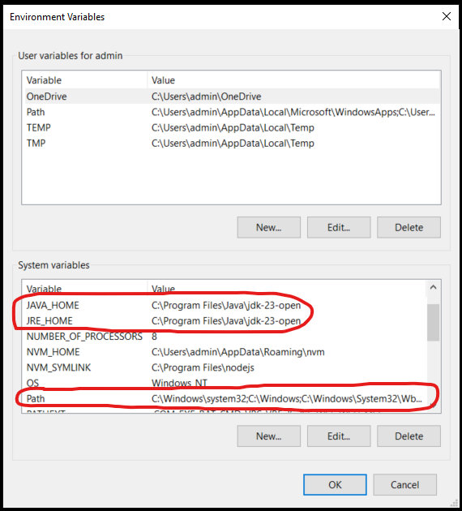
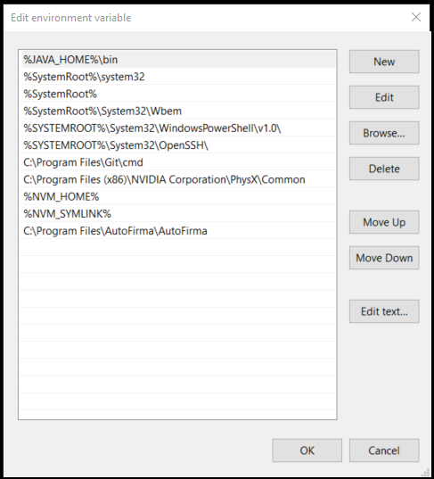
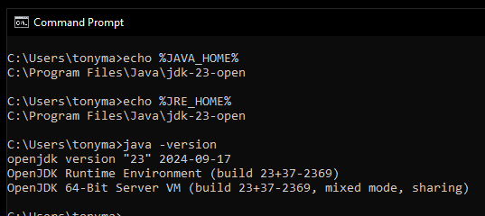

# Instalar y configurar Java

Vamos a seguir los siguientes pasos
- Vamos a descargar el java [Open JDK](https://jdk.java.net/), a fecha actual JDK 23
- Descomprimimos el zip en la ruta `C:\Program Files\Java\jdk-23-open`
  - Si no existe se crea la ruta
- En el buscador de Windows buscamos _variables de entorno_ del __sistema__

- Se abre la ventana _Propiedades del Sistema_ entramos en:

- Se abre la ventana _Variables de entorno_ entramos en:

- Se crear o modifican las variables:

|Nombre|Valor|
|-|-|
|JAVA_HOME|`C:\Program Files\Java\jdk-23-open`|
|JRE_HOME|`C:\Program Files\Java\jdk-23-open`|

  - Se modifica o añade en la variable `Path`:
    - Se añade un nuevo elemento: `%JAVA_HOME%\bin`
    - Se pone como prime elemento de la lista

## Validación

Abrimos una terminal nueva (si está abierta antes de las configuraciones __NO__ se va a obtener un resultado correcto).
Debería salir un resultado muy parecido al siguiente:

