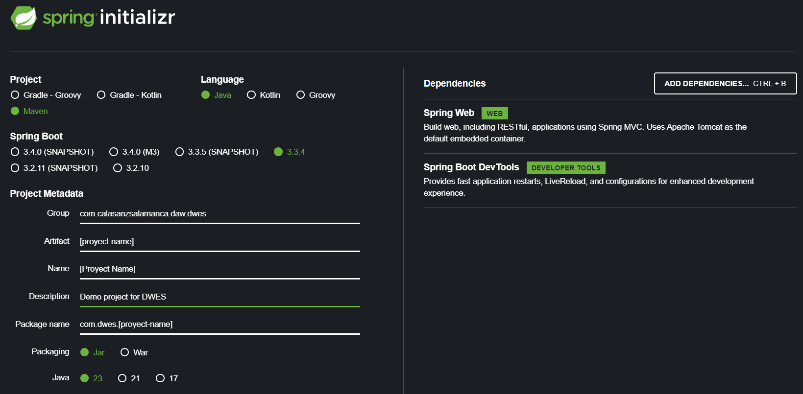
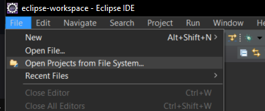
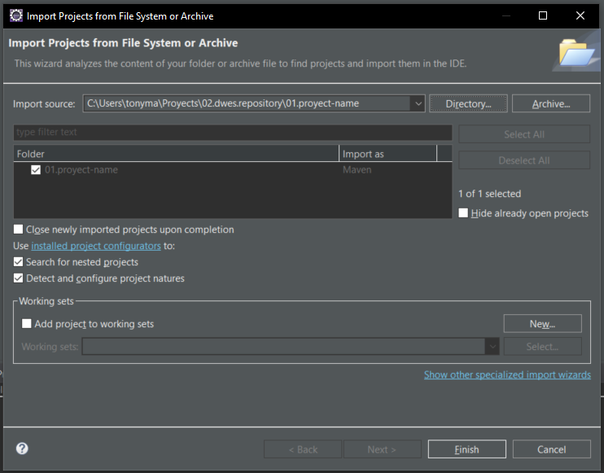
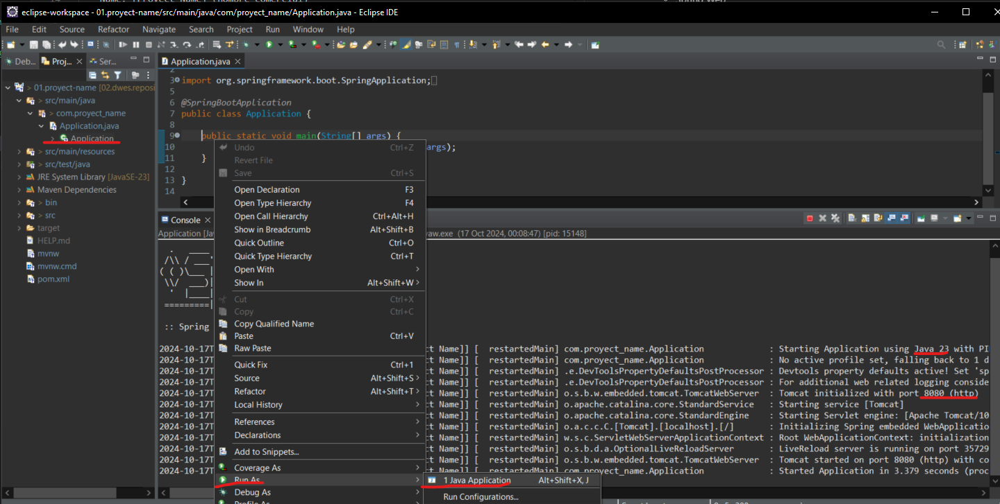
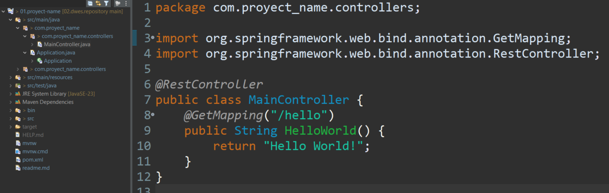
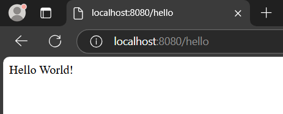
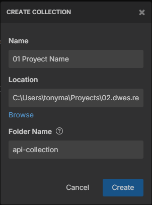
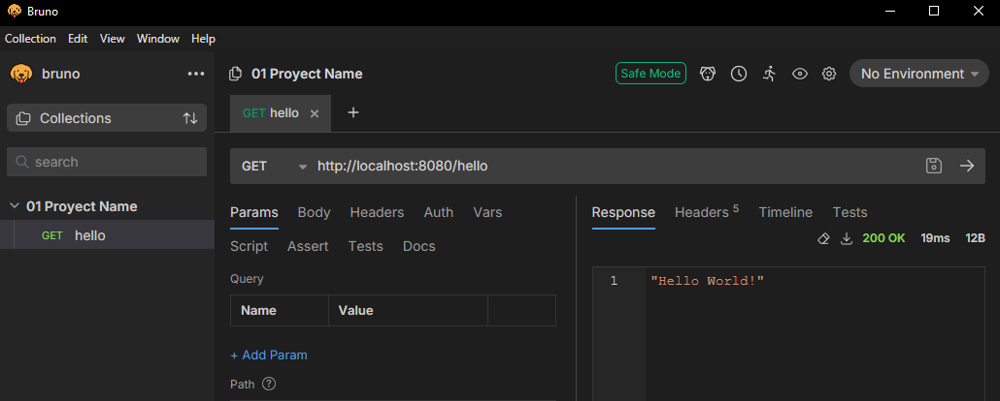

# 01 Proyect Name

Proyecto inicial en el que vamos a ir añadiendo la funcionalidad para construir una aplicación Spring MVC.

Para crear un proyecto base entramos en la página [Inicializar proyecto Spring Boot](https://start.spring.io/).

Seleccionamos:
- Project: Maven (más rápido)
- Language: Java
- Spring Boot: 3.3.4
- Project Metadata
  - Group: com.calasanzsalamanca.daw.dwes
  - Artifact: [proyect-name] (nombre del compilado)
  - Name: [Proyect Name] (nombre comercial)
  - Description: Demo project for DWES (descripción de la herramienta)
  - Package name: com.[proyect-name] (ruta base de los paquetes)
  - Packaging: Jar (contiene tanto el server como la aplicación)
  - Java: 23 (la que tenemos instalada)
- Dependencies:
  - Spring Web
  - Spring Boot DevTools (si se usa con IntelliJ IDEA)

Generamos y descargamos el proyecto base de Spring en un zip.
Lo descomprimimos en la ruta que queramos.
Abrimos nuestro Eclipse y desde el menú superior desde _File_ > _Open Projects from File System..._.

Import source: ponemos la ruta de la carpeta que hemos descomprimido.
Y en el proyecto a importar nos aseguramos que se importe como Maven.

En el menu izquierdo desplegamos hasta encontrar el fichero `Application.java`.
Sobre el fichero que se abre hacemos click derecho y buscamos `Run As` y seleccionamos `Java Application`.

Una vez se ha levantado el servidor, podemos ver en la consola (parte inferior del eclipse) la versión en la que se está ejecutando Java y el puerto en el que se levantado el servidor.

Una vez hemos levantado y corriendo el proyecto. Creamos:
- Nuevo paquete `controllers`
- Dentro un `MainController.java`
  - Añadimos la decoración `@RestController` a la clase creada (`MainController`)
  - Añadimos un método `Hello World!` que devuelva un `String`
  - Añadimos la decoración `@GetMapping("/hello")` al método (`HelloWorld`). Esta decoración nos va a crear endpoint con una ruta en la navegación de nuestro servidor.

Si ejecutamos `http://localhost:[PORT]/hello` debería devolvernos el `Hello World!` que hemos indicado en el endpoint.

Como vamos a tener varios endpoints se recomienda tener una herramienta que los gestione, en este caso usaremos bruno.

Creamos un `request` con el nombre del endpoint y hacemos la petición igual que en el navegador. Podemos ver que la respuesta es igual para el 

